# Attributes on OpenStreetMaps

### ⭐ Key: [Smoothness](https://wiki.openstreetmap.org/wiki/Key:smoothness) (field)

> Physical usability of a way for wheeled vehicles, particularly regarding surface regularity/flatness
> 
- `smoothness` values:
    
    
    | Smoothness Key | Usable By (Example Vehicles) | Description | Notes |
    | --- | --- | --- | --- |
    | `excellent` | Roller blade, skateboard, all below | As-new asphalt/concrete, smooth paving stones with seamless connections | Best surface smoothness |
    | `good` | Racing bike, sport motorcycles, all below | Asphalt/concrete with minor wear like small cracks, shallow dents | Best roads paved with bricks, sett also included |
    | `intermediate` | City bike, sports cars, wheelchairs, cruiser motorcycles | Asphalt showing signs of maintenance, minor potholes and patches, affects speed but still passable well | Best compacted unpaved roads included |
    | `bad` | Trekking bike, normal cars, standard motorcycles | Heavily damaged paved roads, many potholes, average car speed <50%, ground clearance >14 cm sufficient | Good unpaved roads also included |
    | `very_bad` | High-clearance vehicles, light off-road vehicles | Unpaved roads with potholes and ruts, passable with SUV ground clearance (≥18 cm) | Rough terrain |
    | `horrible` | Heavy off-road vehicles, dual-sport motorcycles | Unpaved tracks with deep ruts and rocks needing ground clearance ≥21 cm | Skid plate protection advisable |
    | `very_horrible` | Specialized off-road vehicles, tractors, ATVs | Tracks with deep ruts and obstacles needing ground clearance ≥24 cm | Includes mountain bikes and trial/enduro motorcycles |
    | `impassable` | None | Ways not passable by any wheeled vehicles, including mountain bikes, useful only for hikers | Could be disused or abandoned roads |
- should be used on elements:
    - ways
    - areas
- how smoothness looks like on OSM
    
    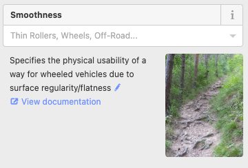
    
    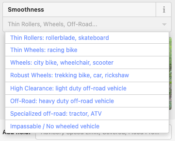
    

### Key: [Wheelchair](https://wiki.openstreetmap.org/wiki/Key:wheelchair) (tag)

> ways that are suitable to be used with a wheelchair and a person with a disability who uses another mobility device (like a walker)
> 
- `wheelchair` values:
    
    
    | Value | Description | Additional Notes |
    | --- | --- | --- |
    | `yes` | Full unrestricted access for wheelchairs | Compliant with ADA in the USA; e.g. stepless entry & rooms |
    | `designated` | Area or way purpose-built for wheelchair use (rarely used) | Elevator designed exclusively for wheelchair access |
    | `limited` | Partial access (some areas accessible; assistance might be needed) | Steps no higher than 7 cm; key rooms accessible |
    | `no` | No unrestricted access (e.g., stairs only access) | Steps higher than 7 cm; important rooms not accessible |
- should be used on elements:
    - nodes
    - ways
    - areas
    - relations
- how `wheelchair` looks like on OSM
    
    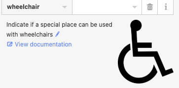
    
    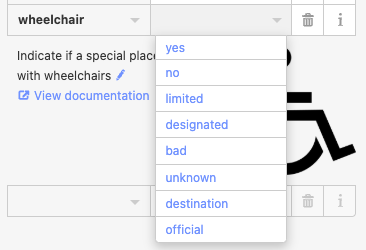
    

### Key: [Ramp](https://wiki.openstreetmap.org/wiki/Key:ramp#Ramp_types) (tag)

> whether or not there is a ramp available
> 
- `ramp` values:
    
    
    | Ramp Value | Description | Notes |
    | --- | --- | --- |
    | `ramp=yes` | There is a ramp built into the stairway | You should also specify ramp type if possible |
    | `ramp=separate` | A ramp exists on the same route but mapped as a separate OSM object | Separate object tagged with highway=footway and incline=* |
    | `ramp:wheelchair=yes` | A ramp usable by wheelchairs, typically no steeper than 4-6%, wide enough for access | Can also be mapped as ramp=separate |
    | `ramp:portable=yes` | Indicates a deployable portable ramp for wheelchair access (e.g. at railway platforms) | Additional tags for width, length, weight capacity, supervision possible |
    | `ramp:bicycle=yes` | A ramp beside steps to allow bicycles to be pushed without lifting (sometimes called a "runnel") | May be automatic (self-moving) |
    | `ramp:stroller=yes` | Ramps allowing strollers (and bicycles) to be pushed up stairs | Usually a pair of narrow ramps with stairs in the middle |
    | `ramp:luggage=yes` | A ramp for luggage, often at train stations | Can be automatic (self-moving) or manual |
    | `ramp=no` | No ramp present (default) | Useful explicitly for routing, especially for wheelchair accessibility |
- normally used on `highway=steps`
- should be used on elements:
    - ways
- how ramp looks like on OSM
    
    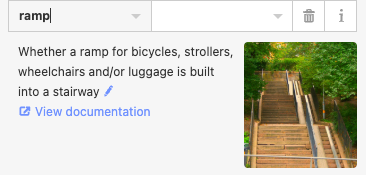
    
    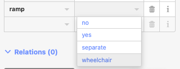
    
    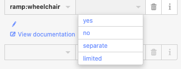
    
    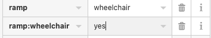
    

### Key: [Surface](https://wiki.openstreetmap.org/wiki/Key:surface) (field)

> Physical `surface`, material composition and/or structure
> 
- `surface` values are divided in 3 main categories:
    - `PAVED`
        
        not a full list, mostly used values
        
        | Surface Type | Description | Approx. Usage % | Notes |
        | --- | --- | --- | --- |
        | `asphalt` | Asphalt concrete | ~46 % | Most common paved surface |
        | `paved` | General paved surface (stones, concrete, bitumen) | ~6 % | Use more specific values if possible |
        | `concrete` | Portland cement concrete | ~6 % | Includes lanes and plates |
        | `paving_stones` | Smooth surface with artificial/natural stones | ~6 % | Narrow gaps, flat top |
        | `cobblestone` | Used ambiguously, better replaced by sett or unhewn_cobblestone | ~0,2 % | Use more precise value |
        | `metal` | Metal surfaces on bridges or temporary tracks | ~0,07 % | Not crushed rock |
        | `wood` | Wood surfaces (bridges, decking) | ~0,36 % |  |
        | `bricks` | Dried clay bricks | <0,01 % | Sometimes treated as paving stones |
    - `UNPAVED`
        
        not a full list, mostly used values
        
        | Surface Type | Description | Approx. Usage % | Notes |
        | --- | --- | --- | --- |
        | `unpaved` | Loose covering, from stone chippings to soil | ~17 % | Rough description |
        | `ground` | Ground with human/animal use marks | ~5 % | Use more precise if possible |
        | `gravel` | Range from large gravel to compacted surface | ~3,2 % | Large meaning range |
        | `dirt` | Exposed soil, not sand or gravel | ~2,5 % | Sometimes confused with gravel |
        | `grass` | Grass-covered ground | ~1,9 % | May turn into dirt or disappear |
        | `compacted` | Gravel and sand mixture, compacted | ~1,8 % | Also called water-bound macadam |
        | `fine_gravel` | Fine loose gravel or alias for compacted | ~0,7 % |  |
        | `shells` | Crushed or whole seashells | <0,01 % | Common in Netherlands footways |
        | `rock` | Large rocks or bare rock | <0,01 % | Mountainous areas |
        | `pebblestone` | Loosely arranged rounded stones | ~0,2 % |  |
        | `mud` | Wet, soft ground with low carrying capacity | <0,01 % | Found in wetlands or tidal areas |
        | `sand` | Small rock fractions (<2 mm) | ~0,8 % |  |
        | `woodchips` | Wood chips or bark | <0,01 % | Playgrounds or walking trails |
        | `snow` | Compacted snow | <0,01 % | Winter roads |
        | `ice` | Ice roads, winter roads | <0,01 % |  |
        | `salt` | Dry salt lakes | <0,01 % |  |
    - `SPECIAL`
        
        not a full list, mostly used values
        
        | Surface Type | Description | Approx. Usage % | Notes |
        | --- | --- | --- | --- |
        | `artificial_turf` | Synthetic grass-like surface for sports | <0,1 % | Football, baseball pitches |
        | `tartan` | Synthetic all-weather sports tracks | <0,1 % | Running tracks |
        | `clay` | Common on tennis courts and some sports | <0,1 % | Also soccer, athletic tracks |
        | `acrylic` | Acrylic resin coating for courts | <0,01 % | Tennis, basketball courts |
        | `rubber` | Recycled rubber safety surfacing | <0,01 % | Playgrounds |
        | `carpet` | Indoor sports courts, some corridors | <0,01 % | Indoor tennis courts |
        | `plastic` | Plastic surfaces for pitches and playgrounds | <0,01 % |  |
- should be used on elements:
    - nodes
    - ways
    - areas
- how surface looks like on OSM
    
    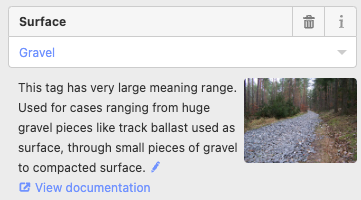
    
    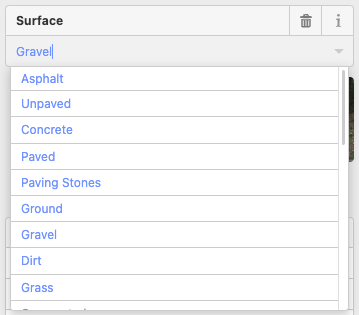
    

### Key: [Barrier](https://wiki.openstreetmap.org/wiki/Key:barrier) (tag)

> physical structure which blocks or impedes movement
> 
- barrier values:
    - linear (along path/road)
        
        
        | Barrier value | Description |
        | --- | --- |
        | `cable_barrier` | Guard cable of steel wire ropes on weak posts |
        | `city_wall` | Fortification enclosing a city/settlement, with height considerations |
        | `ditch` | Trench or ravine, often with flowing water |
        | `guard_rail` | Crash barrier (right side inner, left side outer) |
        | `handrail` | Designed to provide hand support |
        | `hedge` | Line of shrubs or bushes forming a barrier or boundary |
        | `retaining_wall` | Wall retaining lateral soil pressure |
        | `wall` | Solid structure restricting movement (brick, concrete, stone) |
    - access control
        
        
        | Barrier value | Description |
        | --- | --- |
        | `block` | Large [immobile block](https://upload.wikimedia.org/wikipedia/commons/thumb/a/a7/Roadblock_in_Palestine.jpg/200px-Roadblock_in_Palestine.jpg) (concrete or boulder) stopping vehicles |
        | `bollard` | Solid pillars blocking traffic, usually concrete or metal |
        | `border_control` | International border checkpoint |
        | `bump_gate` | Special type of gate |
        | `bus_trap` | Road designed to trap buses |
        | `cattle_grid` | Bars on road allowing vehicles but blocking livestock |
        | `coupure` | Flood protection cut in walls/levees/floodwalls, flood tight if needed |
        | `cycle_barrier` | Barriers to bicycle traffic, allowing pedestrians but slowing cyclists |
        | `debris` | Road blocked by debris |
        | `entrance` | Gap in linear barrier (access=yes implied) |
        | `full-height_turnstile` | Full-height [turnstile](https://upload.wikimedia.org/wikipedia/commons/thumb/2/2f/TR-a.JPG/200px-TR-a.JPG) for security |
        | `gate` | Openable entrance through a barrier (combine with access=*) |
        | `hampshire_gate` | Temporarily removable wire fence section |
        | `height_restrictor` | Physical height restrictor (combine with maxheight=*) |
        | `horse_stile` | Pedestrian and horse crossing, blocking motorcycles & livestock |
        | `kent_carriage_gap` | UK gap allowing horse carriages but blocking motor vehicles |
        | `kissing_gate` | Gate allowing people but not livestock |
        | `lift_gate` | Pivoting bar boom barrier (combine with access=*) |
        | `motorcycle_barrier` | Barriers blocking motorcycles |
        | `planter` | Plant box preventing large vehicles |
        | `sally_port` | Covered gate with two doors |
        | `sliding_beam` | Sliding bar gate |
        | `sliding_gate` | Side-opening automatic gate (combine with access=*) |
        | `spikes` | Ground spikes preventing unauthorized access |
        | `stile` | Pedestrian crossing feature that doesn't open |
        | `sump_buster` | Barrier preventing vehicles with low ground clearance |
        | `swing_gate` | Gate rotating sideways, usually metal bars, blocking cars but allowing pedestrians and cyclists |
        | `toll_booth` | Toll collection point (combine with toll=* and charge=*) |
        | `turnstile` | Small turnstile allowing one person at a time |
        | `wedge` | Wedge-shaped barrier rising from ground |
        | `wicket_gate` | Pedestrian door or gate built into larger door or wall |
        | `parking_lock` | Foldable barrier preventing unauthorised parking |
        | `yes` | Barrier type unknown or unspecified (replace with specific value) |
    - linear or access control
        
        
        | **Linear barriers or control on highways (along or blocking road)** | bar | Fixed horizontal bar blocking vehicles but bypassable on foot or bike |
        | --- | --- | --- |
        |  | barrier_board | Barrier board restricting passage or blocking area |
        |  | bollard | Solid pillars preventing vehicle passage |
        |  | chain | Chain to prevent motorised vehicles |
        |  | fence | Lightweight post-supported structure preventing crossing |
        |  | jersey_barrier | Prefabricated block barrier, use material=plastic/concrete |
        |  | kerb | Short solid barrier preventing vehicle and wheelchair access, height tagged separately |
        |  | log | Barrier made of timber trunks, can be lifted over by cyclists |
        |  | rope | Flexible fibre barrier, often symbolic |
        |  | tank_trap | Static anti-tank obstacle |
        |  | tyres | Crash barrier made of stacked tyres |
        |  | delineator_kerb | Low concrete/plastic barrier hindering wheeled vehicles |
        |  | armadillo | Small ramp separating cycle lanes or neutral areas |
        |  | user_defined | User-defined barrier type |
- includes `kerb` and `turnstilee`
- should be used on elements:
    - nodes
    - ways
    - areas
- how `barrier` looks like on OSM
    
    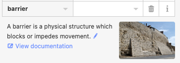
    
    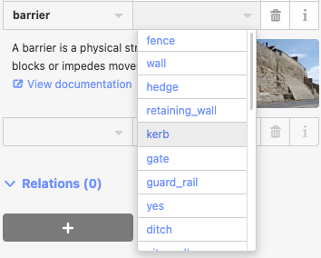
    

### Key: [Incline](https://wiki.openstreetmap.org/wiki/Key:incline) (field)

> Way’s grade, slope, incline
> 
- `Incline` values:
    
    
    | Incline Value | Description | Notes |
    | --- | --- | --- |
    | Numeric % (e.g. `15%`) | Gradient as ratio of vertical to horizontal change, e.g. incline=15% (rise/run × 100%) | Most common way to specify steepness |
    | Numeric ° (e.g. `10°`) | Angle of inclination from horizontal, e.g. incline=10° | Less common, preferred where angle is standard |
    | `up` | Way going uphill, used when exact value unknown | Indicates positive incline |
    | `down` | Way going downhill, used when exact value unknown | Indicates negative incline |
    | `steep` | Tag indicating steep incline (less precise) | Consider verifying or using numeric values |
    | `moderate` | Tag indicating moderate incline | Consider verifying or using numeric values |
    | `steps` | Used mostly on stairs (highway=steps) | Indicates sections with discrete elevation changes (steps) |
    | `very_steep` | Tag indicating very steep incline | Should be verified |
    | `extreme` | Tag indicating extremely steep incline | Should be verified |

- often derived from road signs:
    
    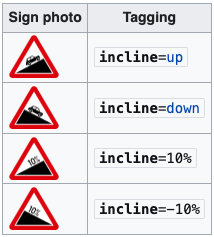
    

- should be used on elements:
    - nodes
    - ways
- how incline looks like on OSM
    
    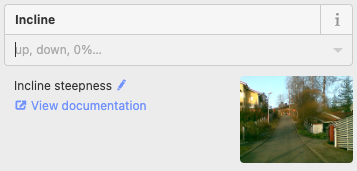
    
    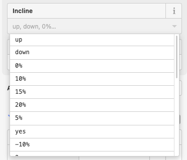
    

### Key: [Access](https://wiki.openstreetmap.org/wiki/Key:access) (tag)

> blanket (primarily, legal) permission for all modes of transport
> 
- `Access` values:
    
    
    | Access Value | Description | Typical Use Case / Notes |
    | --- | --- | --- |
    | yes | Public has official legal right of access | Right of way for everyone |
    | no | Public access completely prohibited for all modes | Strong interdiction; requires specific exceptions for some transport if allowed (e.g., foot=yes) |
    | disabled | holders of blue badge, UK, or other such disabled persons' permit | Used on traffic signs to exempt said group from access restrictions; not just regarding parking |
    | permissive | Open to general traffic but owner can revoke permission anytime | Common on private or semi-private roads |
    | private | Access only with individual permission | Driveways, company parking, private property |
    | designated | Preferred route for specified traffic, usually signposted | Use with specific mode keys, e.g., `foot=designated` |
    | discouraged | Legal right exists but usage discouraged, e.g., HGVs on narrow lanes | Rare and controversial; safety related |
    | customers | Only for customers/visitors of associated feature | Shops, tourist facilities |
    | destination | Only for local/resident traffic (no through traffic) | Access limited to those traveling to the destination |
    | use_sidepath | Specific mode must use a parallel mapped path | Used for cycleways or pedestrians needing segregated paths |
    | dismount | Allowed only if dismounted (e.g., bicycles pushed, not ridden) | For pedestrian zones or graveyards |
    | permit | Access granted only with a permit | Permit holders only |
    | unknown | Access conditions unknown or unclear | Explicitly marks uncertainty |
- **`access=disabled` - specifically tells that disabled can legally pass**
- The default permissions are often implied by the nature of the object; for example, [`highway](https://wiki.openstreetmap.org/wiki/Key:highway)=[footway](https://wiki.openstreetmap.org/wiki/Tag:highway%3Dfootway)` implies that the way is designated for pedestrians and restricted for motor vehicles, but says nothing about e.g. cyclists or horse riders.
- should be used on elements:
    - nodes
    - ways
    - areas
    - relations
- how `access` looks like on OSM
    
    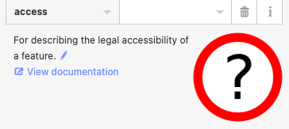
    
    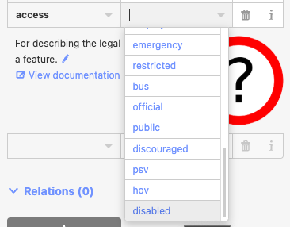
    

### Key: [Foot](https://wiki.openstreetmap.org/wiki/Key:foot) (tag)

> indicates if it is physically possible for a pedestrian to pass
> 
- `Foot` values:
    
    
    | Value | Description |
    | --- | --- |
    | `yes` | Public has legally-enshrined right of access on foot |
    | `no` | Access on foot or by pedestrians is prohibited |
    | `designated` | Preferred or designated route for pedestrians |
    | `permissive` | Access by pedestrians is permitted but may be withdrawn at any time |
    | `use_sidepath` | Use compulsory parallel footpath instead |
    | `private` | Walking not allowed for public, owner may make exceptions |
    | `destination` | Transit traffic forbidden, non-transit to a local destination allowed |
- should be used on elements:
    - nodes
    - ways
    - areas
    - relations
- how `foot` looks like on OSM
    
    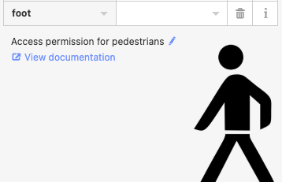
    
    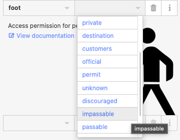