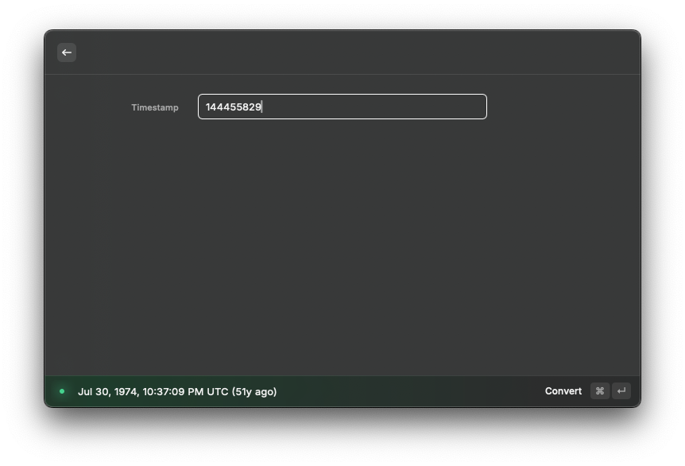

# Photo-Telemetry File Correlation

> Goal: find visual proof that our smoothness estimation is legitimate.
> 
- Looking for pattern: photo folders should directly map to telemetry files using Order ID and timestamps.

## Assumed structure

- Photo folder: `/7b099df4/[DATE]/[ORDER_ID]/`
- Telemetry file: `/telemetry_json/[ORDER_ID]-[VEHICLE_ID].json`

### Examples

- Photo folder: `258276934` → Telemetry: `258276934-579126.json` ✅
- Photo folder: `257670399` → Telemetry: `257670399-579126.json` ✅

The photo file has something that looks like a timecode in the name:

```
185_2025-05-22-11-17-19_7b099df4_8ec72c79-1811-48d5-b275-836c8e4985a5.jpg
```

The telemetry files contain timestamps too

<aside>


Meaning: **This should enable real photo-GPS matching by linking photo folders to correct telemetry files, achieving spatial-temporal correlation to confirm condition of the road.**

</aside>

- the main key timestamp appears to have different purpose rather than coding the correct time.
    - as shown on example conversion images, the timestamps convert to year 1974.

- luckily, there is also GPS data with timestamps that appear to be correct - those convert to May 2025, which seems plausible:

```json
"gpsInfo": {
      "nSatellites": 42,
      "utcTime": "125209",      ← GPS time in HHMMSS format
      "utcDate": "260525",      ← GPS date in DDMMYY format
      "speed": 0,
      "fullNmea": "",
      "swVersion": "",
      "satellites": []
  }
```




## Verification pipeline

> By matching the timecode within the telemetry data and timecodes on images, we could verify if our smoothness values make sense.
> 
- E.g. we could look at the time where the scooter was going with vibration and check what photos were taken on that road.
- If the road confirms to be smooth (asphalt or similar surface clearly visible) - we can confirm our algorithm works properly.

## Images analysis

<aside>


There is likely an issue with numbering of the image files.

</aside>

- Timecodes on images seem to be off.


we take several files as example, which were taken in short period of time, stationary, while we can understand the correct order easily via cars and cloud movements

```
144_2025-05-22-09-33-05_7b099df4_8ec72c79-1811-48d5-b275-836c8e4985a5.jpg
185_2025-05-22-11-17-19_7b099df4_8ec72c79-1811-48d5-b275-836c8e4985a5.jpg
193_2025-05-22-09-18-37_7b099df4_8ec72c79-1811-48d5-b275-836c8e4985a5.jpg
205_2025-05-22-09-44-26_7b099df4_8ec72c79-1811-48d5-b275-836c8e4985a5.jpg
215_2025-05-22-09-35-19_7b099df4_8ec72c79-1811-48d5-b275-836c8e4985a5.jpg
217_2025-05-22-09-17-05_7b099df4_8ec72c79-1811-48d5-b275-836c8e4985a5.jpg
```

[wheels4wheels weird photos numbering](Photo-Telemetry_File_Correlation/wheels4wheels%20weird%20photos%20numbering%20250ce885100180a182e1d867955fdbf4.csv)

[this appears to be a correct order ](Photo-Telemetry_File_Correlation/Screen_Recording_2025-08-15_at_21.28.10.mp4)

this appears to be a correct order 

## **The problem**

- the timestamps seem to be somewhat random
- the indices in front of the file are reversed
- the UUID is stable but not helpful

## **What we need**

- To understand how the images are time coded
- Then we can link them to time codes within GPS coordinates
- Then we can perform visual checks

> So basically we need to talk to Bolt technicians and ask them how they code the images.
>