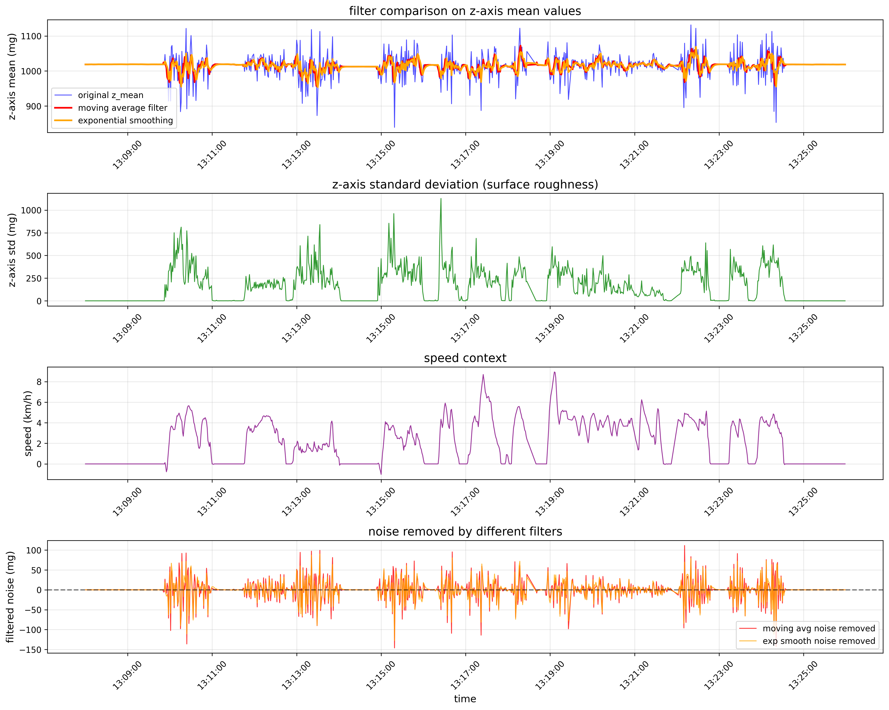
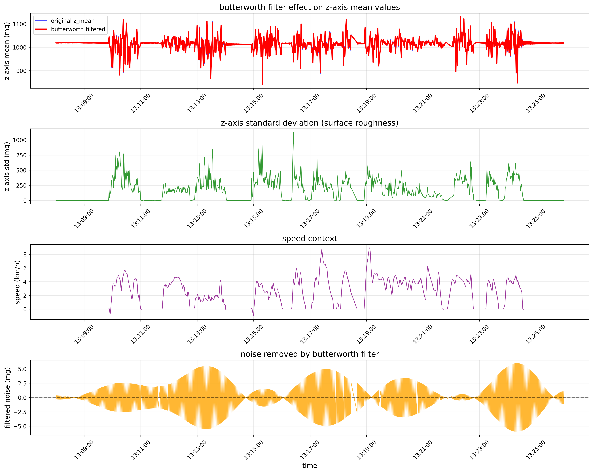
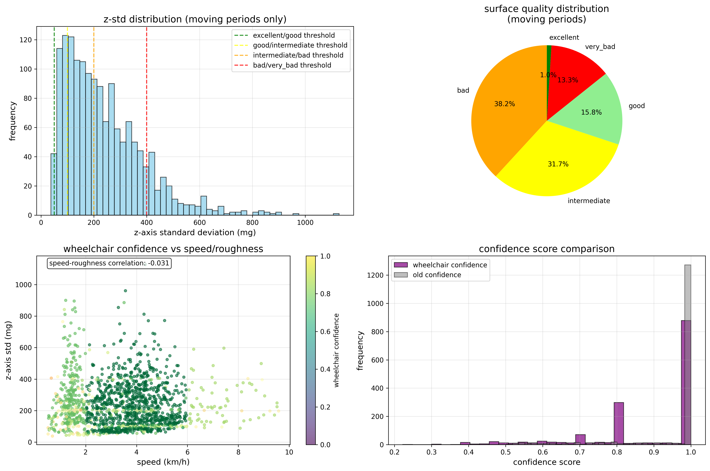
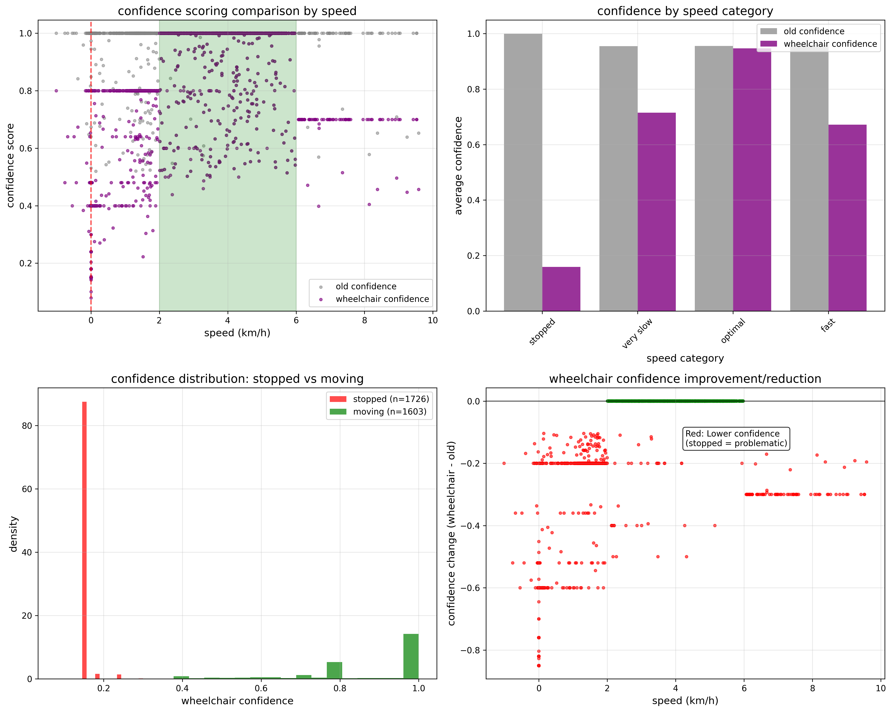
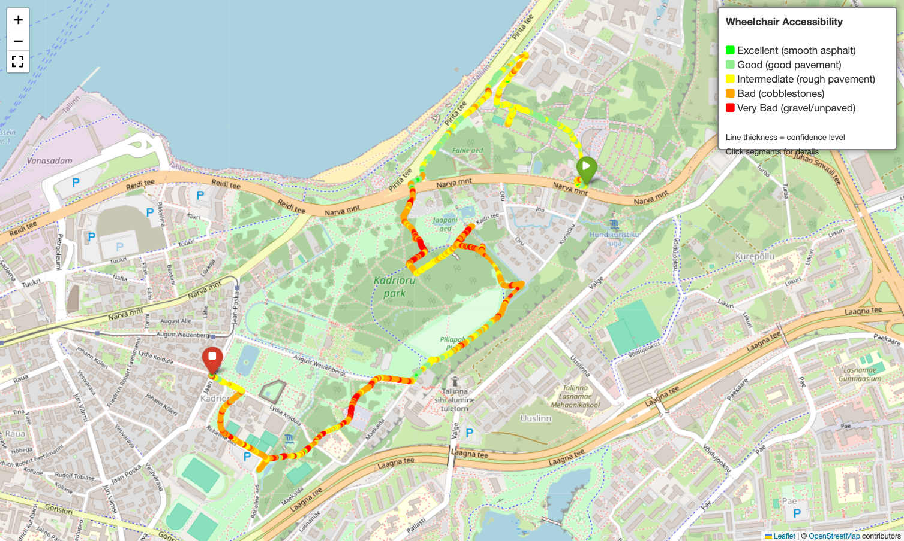

# Surface Smoothness Analysis

> Method: Z-axis accelerometer data analysis for wheelchair accessibility assessment.
> 

## Main Data Source

- Key parameter for scooter’s movement: Z-axis accelerometer data from `accelerationCoord` array
- Geoposition source: `gpsPos` array
- Timecode source: `gpsInfo` array
- Speed source: `currentSpeed` key
    - **Speed Units**: we assume that speed values are in **centimeters per second (cm/s)**
        - Max speed in the file we have analyzed: 283 units, then: $283 cm/s = 10.2 km/h$
        - 10.2 km/h is reasonable for e-scooter
        - Our data shows speeds like 108-136 cm/s = 3.9-4.9 km/h (plausible)
        - **Conversion:** multiply by 0.036 to get km/h (e.g., $100 cm/s = 3.6 km/h$)

### Full list of keys present in the telemetry files

| Key | Type | Description |
| --- | --- | --- |
| `timestamp` | str | Device time in milliseconds |
| `accelerationCoord` | list[90] | X,Y,Z accelerometer data (30 samples) |
| `gpsPos` | dict | GPS coordinates and accuracy |
| `gpsInfo` | dict | GPS metadata (satellites, speed*) |
| `currentSpeed` | list[4] | Speed measurements |
| `drPos` | dict | Secondary GPS position |
| `brakeHandlePosition` | list[4] | Brake input samples |
| `acceleratorHandlePosition` | list[4] | Throttle input samples |
| `current` | list[4] | Battery current readings |
| `voltage` | list[4] | Battery voltage readings |
| `gsmSignal` | int | GSM signal strength |
| `batterySoc` | int | Battery state of charge |
| `accelerationCurrent` | int | Motor current |
| `accelerometerProfile` | str | Accelerometer configuration |
| `rotationRates` | list | Gyroscope data (usually empty) |

### Accelerometer Data Processing

**Raw vs Processed Data:**

- **Original dataset**: Contains 30 raw Z-axis sensor readings per timestamp
    - `accelerationCoord`: 90 values = 30 triplets of [X, Y, Z]
    - Each Z-value is a raw milligravity measurement (~30Hz sampling, meaning 30 values per second)
        - Units: Milligravity (mg) = 1/1000 of Earth's gravity: 9.8/1000 ≈ 0.0098 m/s²
- **Our DataFrame**: We aggregate the 30 raw values into summary statistics
    - `z_mean`: Average of 30 raw Z-readings (baseline gravity + motion)
    - `z_std`: Standard deviation of 30 raw Z-readings (surface roughness indicator)

**Why Standard Deviation for Surface Quality?**

- When a scooter stands still or rides on a perfectly smooth road, all 30 sensor readings are equal or very similar - close to 1000mg (Earth's gravity, 9.8 m/s²).
- On a bumpy road, those 30 readings jump around wildly - depending on the road condition.

> [*Standard deviation*](https://en.wikipedia.org/wiki/Standard_deviation) = **"How much do the numbers bounce around?"**
> 

We work with the following assumptions:

- **Low std (0-50mg)**: Smooth asphalt - readings are consistent = wheelchair-friendly
- **High std (200+mg)**: Rough cobblestones - readings vary wildly = might be challenging for wheelchairs, especially under not ideal weather conditions (rain, snow, ice)
- We assume that the rider is not affecting the sensors by throwing the scooter around aggressively.

> So we propose to use standard deviation because **it captures the “bumpiness” that the scooter rider experience in comparison to standing still.**
> 

## Converted Data Example

From file: `telemetry_json/258276934-579126.json`

| timestamp | gps_datetime | gps_lat | gps_lon | gps_accuracy | x_mean | y_mean | z_mean | z_std | speed_cms | speed_kmh |
| --- | --- | --- | --- | --- | --- | --- | --- | --- | --- | --- |
| 511808463 | 2025-05-26 12:52:09 | 59.443302 | 24.8064 | 1.80 | 33.233333 | 120.033333 | 1014.266667 | 0.928559 | 0.0 | 0.0 |
| 511809462 | 2025-05-26 12:52:10 | 59.443302 | 24.8064 | 1.76 | 33.200000 | 120.000000 | 1013.633333 | 0.657436 | 0.0 | 0.0 |
| 511810461 | 2025-05-26 12:52:11 | 59.443302 | 24.8064 | 1.72 | 33.100000 | 120.333333 | 1013.733333 | 0.573488 | 0.0 | 0.0 |
| 511811460 | 2025-05-26 12:52:12 | 59.443302 | 24.8064 | 1.72 | 33.100000 | 120.233333 | 1013.766667 | 0.615540 | 0.0 | 0.0 |
| 511812459 | 2025-05-26 12:52:13 | 59.443302 | 24.8064 | 1.72 | 33.133333 | 120.066667 | 1013.933333 | 0.573488 | 0.0 | 0.0 |

.](Surface_Smoothness_Analysis/image.png)

Image 1: Full json file raw data as graph. In blue, we see clear periods of idling (z-axis is unrealistically constant), and period of riding. In red, we see the standard deviation, which can be approximated to the bumpiness of the road the scooter rider has passed (the higher - the bumpier). Orange bars represent a segment that will be evaluated as example, see [Image 2](https://www.notion.so/Surface-Smoothness-Analysis-254ce885100180349645c7896407d50c?pvs=21).

### Checking that constant periods of z-axis is indeed idling

- around 13:20 (movement expected):
    - speed values (km/h): [4.752, 4.896, 4.914, 4.725, 4.437]
    - avg speed: 3.9 km/h
    - `z_std` range: 74.4 - 499.0mg
- around 13:30 (idle expected):
    - speed values (km/h): [0.0, 0.0, 0.0, 0.0, 0.0]
    - avg speed: 0.0 km/h
    - `z_std` range: 0.5 - 0.8mg

> So speed is indeed 0.0 km/h in second case, which confirms scooter is highly likely stationary during all prolonged low `z_std` periods.
> 

### Confidence Scoring

> We must provide some kind of score to our estimates so that the OpenStreetMap reviewers can filter our input based on how sure we are that the wheelchair can pass.
> 

What Confidence Means in our Case : "How confident are we that a wheelchair user can traverse this surface safely and without interruption?"

Factors for Better Confidence Scoring:

- Confidence **REDUCERS**:
    1. **Speed = 0:** Unknown stop reason (obstacle? dangerous surface? steep incline?)
    2. **Very high speed:** Likely downhill, not representative of wheelchair capability
    3. **Speed variations**: Sudden changes indicate navigation challenges
    4. **Near thresholds:** Classification uncertainty
- Confidence **BOOSTERS**:
    1. **Steady moderate speed:** 2-6 km/h (typical wheelchair pace)
    2. **Clear classification:** Far from smoothness thresholds
    3. **Consistent measurements:** Stable `z_std` over time
    4. **Continuous movement:** No unexpected stops

## Smoothness Classification Thresholds

> Based on [Attributes on OpenStreetMaps](https://www.notion.so/Attributes-on-OpenStreetMaps-24ece885100180438440e2983dccc4ab?pvs=21)
> 
- **Excellent**: < 50 mg (smooth asphalt)
- **Good**: 50-100 mg (good pavement)
- **Intermediate**: 100-200 mg (rough pavement) ← accessibility threshold
- **Bad**: 200-400 mg (cobblestones)
- **Very Bad**: > 400 mg (gravel/unpaved)

## Processed Sample Example

).](Surface_Smoothness_Analysis/image_1.png)

Image 2: Showcasing datapoints classification on a segment of a ride (marked with orange bars on [Image 1](https://www.notion.so/Surface-Smoothness-Analysis-254ce885100180349645c7896407d50c?pvs=21)).

### Possible post-processing and further data aggregation

- Increasing the fluidity of data
    
    
    
    Image 3: if we can confirm that “very bad” surfaces are *not that bad*, then we might want to smoothen the spikes, effectively classifying more segments of the road as “intermediate”. See how it compares on the bottom plot - red line is with smoothing, has none “very bad” segments.
    
- Filtering comparison, various methods
    
    > Without getting into the details, the purpose is basically to smoothen the spikes for the same reason as explained on [Image 3](https://www.notion.so/Surface-Smoothness-Analysis-254ce885100180349645c7896407d50c?pvs=21).
    > 
    
    **Hypothesis behind Filtering and Noise Patterns**
    
    > The orange "noise removed" visualization reveals **oscillating wave patterns** that demonstrate the Butterworth filter's effect.
    > 
    
    **What the Oscillations May Represent:**
    
    - **Wheel rotation harmonics**: Regular vibrations as scooter wheels turn
    - **Motor vibrations**: Electric motor creates periodic oscillations during movement
    - **Mechanical noise**: High-frequency vibrations from scooter components
    - **Speed correlation**: Some correlation with speed is likely present
    
    **Key Filtering Insights:**
    
    - **10Hz cutoff frequency**: Likely removes high-frequency mechanical noise while preserving surface roughness
    - **Wave patterns around zero**: Filter maintains signal baseline, removing only oscillations
    - **Speed-dependent filtering**: More noise removed during faster movement periods
    - **Idle period accuracy**: Minimal filtering needed when stationary (speed = 0)
    
    ### Wheelchair Accessibility Implications
    
    **Without Butterworth Filtering:**
    
    - Motor and wheel vibrations may be misclassified as surface roughness
    - False "bad" or "very_bad" smoothness ratings on actually smooth surfaces
    - Overestimation of accessibility challenges for wheelchair users
    
    **With Butterworth Filtering:**
    
    - True surface texture preserved for accurate wheelchair accessibility assessment
    - Mechanical vibrations filtered out to focus on actual road conditions
    - May result in more reliable OSM smoothness classifications based on real surface quality
    
    
    
    Image 4: comparison of various filtering methods
    
    
    
    Image 5: Effect of butterworth filter - cyclical oscillations in data which might be correlating with e.g. movements of the wheel, it may or may not be useful, so information is provided as is for the context.
    
- Statistical analysis of the segment classification
    
    
    
    Image 6: various statistical metrics on the analyzed segment. 
    
    statistical analysis summary (wheelchair accessibility focus):
    total data points: 3359
    moving periods: 1535 points (45.7%)
    idle periods: 1824 points (54.3%)
    
    z-std statistics (moving periods only):
    mean: 237.62 mg
    median: 205.00 mg
    std deviation: 150.13 mg
    min: 37.85 mg
    max: 1128.13 mg
    
    smoothing quality distribution (moving periods):
    bad: 586 points (38.2%)
    intermediate: 487 points (31.7%)
    good: 243 points (15.8%)
    very_bad: 204 points (13.3%)
    excellent: 15 points (1.0%)
    
    wheelchair confidence analysis:
    wheelchair-friendly surface: 16.8% of moving periods
    avg wheelchair confidence: 0.883
    avg old confidence: 0.956
    
    confidence by speed category:
    optimal wheelchair speed (2-6 km/h): 0.947
    slow movement (<2 km/h): 0.731
    fast movement (>6 km/h): 0.671
    speed vs roughness correlation: -0.031
    
    osm tagging suggestion (wheelchair accessibility focused):
    smoothness=bad
    wheelchair=no
    confidence_score=0.88
    
- Confidence scoring analysis
    
    
    
    Image 7: Confidence score analysis - comparing old and new method. Old method was assuming that idle periods have high confidence, which may be wrong.
    
    confidence by movement state:
    stopped periods:
    old confidence: 0.999
    wheelchair confidence: 0.152
    confidence reduction: 0.847
    moving periods:
    old confidence: 0.956
    wheelchair confidence: 0.868
    
    why stopped periods have lower wheelchair confidence:
    
    - unknown reason for stopping (obstacle? steep incline? dangerous surface?)
    - cannot assess continuous movement capability
    - not representative of wheelchair navigation requirements
    
    optimal wheelchair speed analysis (2-6 km/h):
    data points in optimal range: 1099 (32.7%)
    avg wheelchair confidence: 0.947
    avg surface quality: 229.4 mg
    
    key improvements in wheelchair confidence scoring:
    
    1. penalizes stopped periods (potential obstacles/challenges)
    2. rewards optimal wheelchair speeds (2-6 km/h)
    3. considers movement continuity (recent stops)
    4. accounts for speed appropriateness (not just surface quality)
    5. better reflects actual wheelchair accessibility challenges

## Mapping Track on OSM Tiles

> The mapping on OSM tiles was performed with help of [folium](https://python-visualization.github.io/folium/latest/) python package, which can pull tiles from OpenStreetMap source.
> 

Image 8: full track overview with legend. The GPS coordinates seem plausible: the city is correct, the scooter rider seemingly mostly was using marked roads.

Image 9: zooming in shows that somewhat prolonged paths where the road went through properly marked roads are “good/excellent” (likely asphalt), the road in a park is “very bad” (likely unpaved), crossroads are “intermediate” (likely bumpy due to curbs or road hight differences). 

## Example export data

> We need to collaborate with OSM contributors to figure out which format is the most suitable for them.
> 

Below are two examples of the data which we can provide to Geofabrik or other OSM contributors for evaluation and feedback. 

[wheelchair_accessibility_smoothness_20250819_142057.geojson](Surface_Smoothness_Analysis/wheelchair_accessibility_smoothness_20250819_142057.geojson)

[smoothness_segments_20250819_142057.csv](Surface_Smoothness_Analysis/smoothness_segments_20250819_142057.csv)

## Proposed Processing Pipeline

1. Extract `Z-axis` values from `accelerationCoord` triplets (x, y, z) - 30 samples per
timestamp
2. Calculate [standard deviation](https://pandas.pydata.org/docs/reference/api/pandas.core.window.rolling.Rolling.std.html) for `z-axis` component (across 30 samples per data point)
3. Parse real-world datetime from `gpsInfo` (`utcTime` and `utcDate`)
4. Convert speed from `currentSpeed` (cm/s) to km/h using factor 0.036
5. Apply smoothness classification using `z-axis` `std` thresholds (excellent < 50mg, good
< 100mg, etc.)
6. Calculate wheelchair confidence based on surface quality + speed appropriateness +
movement continuity
7. Perform optional optimizations (we need to perform [Photo-Telemetry File Correlation ](https://www.notion.so/Photo-Telemetry-File-Correlation-24ece885100180158021dd9cf1509721?pvs=21) check to see what reflects reality best):
    1. *Optional:* Apply [Butterworth](https://en.wikipedia.org/wiki/Butterworth_filter) filter (10Hz cutoff) for noise reduction on raw z-values
    (demonstrated but not required for our aggregated data)
    2. *Optional:* Calculate rolling window analysis (30-sample window) for additional
    smoothness (enhancement, not core pipeline)
8. Map `std dev` to [OSM smoothness categories](https://www.notion.so/Attributes-on-OpenStreetMaps-24ece885100180438440e2983dccc4ab?pvs=21) (`excellent`, `good`, `intermediate`, `bad`,
`very_bad`)
9. Visualize on interactive OpenStreetMap using Folium - overlay GPS path with color-coded smoothness segments for visual validation
10. Export high-confidence segments as `GeoJSON`/`CSV` for OSM contribution

## Results

<aside>

Practical Meaning: 

- z-component from scooter telemetry indeed can represent the smoothness of the road
- the coordinates seem to match with real roads with relatively high accuracy
- the speed contributes to confidence score of the datapoints classification
- the time component of the gpsInfo is a useful source of timecodes that seem plausible
- filtering may improve the classification by compensating spikes of z-axis values and electromechanical noise
- the visual validation could not be performed as the timecodes of the images could not be associated with certain telemetry datapoints, see  [Photo-Telemetry File Correlation ](https://www.notion.so/Photo-Telemetry-File-Correlation-24ece885100180158021dd9cf1509721?pvs=21)
- the plausibility of the estimation has been checked via putting datapoints with classification on a leaflet based on extracted coordinates
- the segments of good/bad quality roads overlap roughly with what we can expect based on the map
- the data can be exported in various formats (geojson, csv or anything else)
- the map leaflet can be turned into a webapp, which would basically provide an interactive path of the scooter based on telemetry data
- **the concept can be considered proven**

- **there is a possibility of near-to-real-time wheelchair accessibility scoring for OpenStreetMap integration based on e-scooter fleet sensor data** (automation of the pipeline would be required)
</aside>