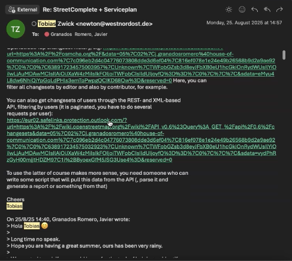

# wheels4wheels | for HoC

prepared by [1ar labs](https://1arlabs.com)

---

> Collection of documents and deliverables for quick reference and collaboration.
> 
> - Table of Content

# Deliverables

---

## Phase 1, research, `completed`

- [x]  research [Attributes on OpenStreetMaps](https://www.notion.so/Attributes-on-OpenStreetMaps-24ece885100180438440e2983dccc4ab?pvs=21) August 13, 2025
- [x]  propose [OpenStreetMap Editors](https://www.notion.so/OpenStreetMap-Editors-24ece88510018044891ec8d1e0259d93?pvs=21) August 13, 2025
- [x]  calculations [Surface Smoothness Analysis](https://www.notion.so/Surface-Smoothness-Analysis-254ce885100180349645c7896407d50c?pvs=21)
    - [x]  pick a ride, extract segment, process, filter data [Converted Data Example](https://www.notion.so/Converted-Data-Example-254ce885100180bab200e9051ed93ba7?pvs=21)
    - [x]  calculate smoothness of a ride [Accelerometer Data Processing ](https://www.notion.so/Accelerometer-Data-Processing-254ce8851001808fbeaddd71fb17ed49?pvs=21)
    - [x]  visualize smoothness over time during the ride [Processed Sample Example](https://www.notion.so/Processed-Sample-Example-254ce885100180d0beb5c766e893ea9a?pvs=21)
    - [x]  provide reproducible research source files [Research notebook ](https://www.notion.so/Research-notebook-254ce885100180108154c7bed440e536?pvs=21)
- [x]  research how accurate rider’s position can be mapped to geodata on OSM [Mapping Track on OSM Tiles](https://www.notion.so/Mapping-Track-on-OSM-Tiles-254ce885100180908990c8d59075ab66?pvs=21)
- [x]  optional: try to attach photos captured during the ride to certain positions of the rider [Photo-Telemetry File Correlation ](https://www.notion.so/Photo-Telemetry-File-Correlation-24ece885100180158021dd9cf1509721?pvs=21)
- [x]  propose pipeline to automate extraction (theoretical work) [Proposed Processing Pipeline](https://www.notion.so/Proposed-Processing-Pipeline-254ce8851001802eb7b8e9f496dbc4d4?pvs=21)
- [x]  fetch a report [Surface Smoothness Analysis](https://www.notion.so/Surface-Smoothness-Analysis-254ce885100180349645c7896407d50c?pvs=21)

Deadline: August 18, 2025 

- [x]  August 22, 2025 [List of Questions (Telemetry data)](https://www.notion.so/List-of-Questions-Telemetry-data-257ce885100180d19eaed4312de070e1?pvs=21) for Bolt technicians
- [x]  August 22, 2025 any way to make the map interactive?
    - web https://w4w.vercel.app/
    - mirror https://w4w.netlify.app/
    - [notion embed](https://www.notion.so/wheels4wheels-for-HoC-24ece885100180e4a9cbc23fb2f4c19d?pvs=21)
- [x]  [Addressing Legal Concerns](https://www.notion.so/Addressing-Legal-Concerns-257ce885100180b99d09f661748b6f85?pvs=21) August 22, 2025
- [x]  [Brief for Additional Scooter Rides](https://www.notion.so/Brief-for-Additional-Scooter-Rides-257ce88510018064a29feaef84813adc?pvs=21) what to test, how to ride August 22, 2025
- [x]  answer question about [incline and curbs](https://www.notion.so/incline-and-curbs-257ce8851001807d890dfe990f296592?pvs=21) August 22, 2025

## Phase 2, production

- [x]  participate meeting with Tarno August 28, 2025
- [x]  [bullet points for Raw Material](https://www.notion.so/bullet-points-for-Raw-Material-25dce885100180c98b74d677053bb4fd?pvs=21) as requested by Rohil

### 1st package

- [ ]  Investigate ways to enrich OSM database programmatically
- [ ]  propose OSM *plakative* enrichment pipeline (e.g. export data in OSM-suitable format or simple script to push data to OSM DB)
- [ ]  document the pipeline
- [ ]  prepare assets for the campaign (fact sheets, graphics, explainers)

### 2nd package

- [ ]  look into 3D visualization with [Mapbox](https://www.mapbox.com/), [create custom map](https://docs.mapbox.com/help/tutorials/create-a-custom-style/)
- [ ]  look into [FumaDocs](https://fumadocs.dev/) as the main framework for the project website
- [ ]  create repository on GitHub, share with Javier for collaboration
- [ ]  setup FumaDocs instance with GitHub as backend
- [ ]  theming/styling of FumaDocs based on design guidance provided by Serviceplan
- [ ]  assist with creation campaign copy based on documentation, in collaboration with Javier
- [ ]  create a simple mapbox visualization (simple semi-interactive animation, ideally with Points of Interest and annotations)
- [ ]  deploy an instance of FumaDocs online (CloudFlare or Vercel) with Mapbox experience

### optional: involving frontend

> the costs of the frontender may be passed through to Serviceplan, or paid by me as-is without overhead
> 
- [ ]  finding, involving and managing 3rd party frontend engineer, who will help with development

### nice-to-haves

- [ ]  calculating timepoints of the photos based on new info about frequency of the shots
- [ ]  linking photos to timepoints of the ride to double check plausibility of the classification

Deadline: November 15, 2025 

# Documents

---

[2025/08/01 w4w | POC proposal | 1ar labs](https://www.notion.so/w4w-POC-proposal-1ar-labs-242ce8851001802b80dffc96fde102c4?pvs=21)

- Example of scooter rider brief
    
    [W4W_Volunteer_Brief.pdf](wheels4wheels_for_HoC/W4W_Volunteer_Brief.pdf)
    

[2025/09/15 w4w | launch assist | 1ar labs](https://www.notion.so/w4w-launch-assist-1ar-labs-25dce885100180f590b8fbf98f062ce0?pvs=21)

# Research

---

- Geofabrik research, by Michael Reichert, Frederik Ramm
    
    [wheel4wheel_full.pdf](wheels4wheels_for_HoC/wheel4wheel_full.pdf)
    

[Attributes on OpenStreetMaps](https://www.notion.so/Attributes-on-OpenStreetMaps-24ece885100180438440e2983dccc4ab?pvs=21)

[OpenStreetMap Editors](https://www.notion.so/OpenStreetMap-Editors-24ece88510018044891ec8d1e0259d93?pvs=21)

[Photo-Telemetry File Correlation ](https://www.notion.so/Photo-Telemetry-File-Correlation-24ece885100180158021dd9cf1509721?pvs=21)

[Surface Smoothness Analysis](https://www.notion.so/Surface-Smoothness-Analysis-254ce885100180349645c7896407d50c?pvs=21)

- Research notebook
    
    > requires a python development environment to run
    > 
    
    [scooter_data_analysis.ipynb](wheels4wheels_for_HoC/scooter_data_analysis.ipynb)
    
    - Test telemetry file that was taken as example:
        
        [258276934-579126.json](wheels4wheels_for_HoC/258276934-579126.json)
        

[List of Questions (Telemetry data)](https://www.notion.so/List-of-Questions-Telemetry-data-257ce885100180d19eaed4312de070e1?pvs=21)

[Addressing Legal Concerns](https://www.notion.so/Addressing-Legal-Concerns-257ce885100180b99d09f661748b6f85?pvs=21)

[Brief for Additional Scooter Rides](https://www.notion.so/Brief-for-Additional-Scooter-Rides-257ce88510018064a29feaef84813adc?pvs=21)

[incline and curbs](https://www.notion.so/incline-and-curbs-257ce8851001807d890dfe990f296592?pvs=21)

[bullet points for Raw Material](https://www.notion.so/bullet-points-for-Raw-Material-25dce885100180c98b74d677053bb4fd?pvs=21)

---

[interactive map with results of the proof of concept research, available online at [https://w4w.vercel.app/](https://w4w.vercel.app/) or [https://w4w.netlify.app](https://w4w.netlify.app/)](https://w4w.vercel.app/)

interactive map with results of the proof of concept research, available online at [https://w4w.vercel.app/](https://w4w.vercel.app/) or [https://w4w.netlify.app](https://w4w.netlify.app/)

# Log & Legal

---

- September 11, 2025 - agreed on expanding the scope beyond just copywriting and assisting support, to also integrating fuma docs, assisting with implementation of mapbox, deployment, while keeping the focus on smoothness as parameter. The goal is to provide a “plakative” view on how this may work by showcasing the analysis, providing documentation, and pushing some portion of the data to OSM. The updated proposal will be provided by @pa1ar in the beginning of the next week. The deadline (best case scenario) for the website delivery is mid November.
- August 28, 2025 - agreed to prolong partnership until launch, November 2025. The scope will be outlined in coming days by @pa1ar and sent to Franz for confirmation.
    - https://wiki.openstreetmap.org/wiki/API_v0.6#Query:_GET_/api/0.6/changesets - suggested way to get the change-sets from OSM as per Tobias
        
        
        
- August 28, 2025 - met with Tarno from Bolt, captured answered to the questions [List of Questions (Telemetry data)](https://www.notion.so/List-of-Questions-Telemetry-data-257ce885100180d19eaed4312de070e1?pvs=21)
- August 22, 2025 - presented results, added several todos to deliver before we wrap up current phase
- August 19, 2025 - documented the research, ready to handover the result or start with the next package [fetch a report [Surface Smoothness Analysis](https://www.notion.so/Surface-Smoothness-Analysis-254ce885100180349645c7896407d50c?pvs=21) ](https://www.notion.so/fetch-a-report-24ece8851001801f8847d114b8d16364?pvs=21)
- 2025/08/13 - [OpenStreetMaps](https://www.notion.so/wheels4wheels-for-HoC-24ece885100180e4a9cbc23fb2f4c19d?pvs=21) parameters collected and sent out alongside with this doc to HoC
- 2025/08/11 - invoice sent out to HoC
    
    1ar lab invoice number: IN-202508-013 from 2025/08/11 
    
    - [x]  sent out to:
        - [creativeoperations@house-of-communication.com](mailto:creativeoperations@house-of-communication.com)
        - [invoices-sp-group@serviceplan.com](mailto:invoices-sp-group@serviceplan.com)
        - [su.horn@house-of-communication.com](mailto:su.horn@house-of-communication.com)
- 2025/08/11 - order number 928826131 issued by HoC
    - contact person Susan Horn [su.horn@house-of-communication.com](mailto:su.horn@house-of-communication.com)
- 2025/08/04 - proposal adjusted, accepted by HoC
- 2025/08/01 - [proposal](https://www.notion.so/w4w-POC-proposal-1ar-labs-242ce8851001802b80dffc96fde102c4?pvs=21) sent out to HoC